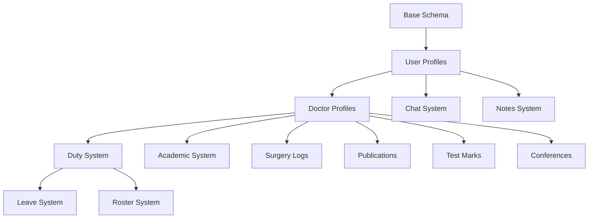

# Database Migration Overview

## Your New Supabase Instance
```
Project: uwoddeszgeewevrydmoc
URL: https://uwoddeszgeewevrydmoc.supabase.co
```

## Migration Timeline (36 migrations)

```
📅 December 23, 2025 - Initial Setup
├─ 20251223063219 - First migration (base schema)
├─ 20251223063240 - Additional tables
├─ 20251223083257 - Core features
├─ 20251223085252 - Enhancements
├─ 20251223085841 - Extended schema
├─ 20251223164204 - Updates
├─ 20251223165939 - Refinements
├─ 20251223170600 - Policies
├─ 20251223171253 - Final Dec 23 updates
│
📅 December 24, 2025
├─ 20251224133102 - Christmas Eve updates
│
📅 December 26, 2025
├─ 20251226030730 - Post-Christmas updates
│
📅 December 31, 2025
├─ 20251231120000 - Add leave limits
│
📅 January 2, 2026
├─ 20260102091500 - Update classes, add materials
├─ 20260102134121 - Add new duty types
├─ 20260102145000 - Seed doctors
├─ 20260102160000 - Create surgery logs
├─ 20260102170000 - Add class fields & seed Jan 2026
│
📅 January 3, 2026
├─ 20260103100000 - Create department channels
├─ 20260103123049 - Seed comprehensive mock data
├─ 20260103125303 - Add conference enum & seed
├─ 20260103125324 - Seed academic classes data
├─ 20260103140000 - Update duties & channels
├─ 20260103150000 - Create notes tables
├─ 20260103160000 - Leave permissions system
├─ 20260103180000 - Roster availability system
├─ 20260103200000 - Fix chat messages policy
├─ 20260103210000 - Fix channel eligibility
├─ 20260103220000 - Add chat images
├─ 20260103230000 - Create publications
│
📅 January 4, 2026 - Latest Updates
├─ 20260104000000 - Add sample duties Jan 4
├─ 20260104100000 - Conference application system
├─ 20260104120000 - Add admin doctor profile
├─ 20260104130000 - Create test marks table
├─ 20260104140000 - Remove can_do columns
├─ 20260104150000 - Remove additional columns
├─ 20260104160000 - Add sample duty assignments
└─ 20260104170000 - Drop old leave functions ✅ LATEST
```

## Key Schema Components

### 👤 User & Profile Management
- `profiles` - User profiles
- `doctor_profiles` - Doctor-specific data
- Authentication integration

### 📅 Scheduling & Duty Management
- `duty_assignments` - Doctor duty schedules
- `roster_availability` - Doctor availability
- `sample_duties` - Duty templates

### 🏥 Clinical Features
- `surgery_logs` - Surgery tracking
- `attendance` - Attendance records
- `camp_management` - Medical camp management

### 📝 Leave & Time Off
- `leave_requests` - Leave applications
- `leave_balances` - Leave tracking
- Leave approval workflow

### 💬 Communication
- `chat_channels` - Department/group channels
- `chat_messages` - Message history
- `chat_images` - Image attachments

### 📚 Academic & Learning
- `academic_classes` - Class schedules
- `class_materials` - Learning resources
- `test_marks` - Exam scores

### 📄 Documentation
- `notes` - Clinical notes
- `publications` - Research publications
- Document versioning

### ✈️ Conference Management
- `conference_requests` - Conference applications
- Application approval system

### 🔒 Security Features
- Row Level Security (RLS) policies on all tables
- Role-based access control
- Secure authentication

## Database Statistics

```
Total Migrations: 36
Total SQL Size: ~154 KB
Seed Data: ~0.3 KB
Tables Created: 20+
Functions: Multiple
Triggers: Multiple
RLS Policies: Comprehensive
```

## What Gets Created

### Tables
✅ Core user & profile tables
✅ Duty & scheduling tables
✅ Leave management tables
✅ Communication tables (chat)
✅ Academic tables
✅ Clinical documentation tables
✅ Conference management tables

### Functions
✅ User creation triggers
✅ Data validation functions
✅ Permission check functions
✅ Cleanup functions

### Policies (RLS)
✅ User can read own profile
✅ Doctor can manage own data
✅ Admin can manage all data
✅ Channel-specific access
✅ Role-based permissions

### Indexes
✅ Performance indexes on frequently queried columns
✅ Foreign key indexes
✅ Composite indexes for complex queries

## Migration Dependencies



## Post-Migration Features Available

After running all migrations, your app will support:

✅ User authentication & profiles
✅ Doctor roster management
✅ Duty scheduling & assignments
✅ Leave request & approval
✅ Attendance tracking
✅ Surgery logging
✅ Department chat/messaging
✅ Clinical notes
✅ Academic class management
✅ Test marks tracking
✅ Publication tracking
✅ Conference request system
✅ Camp management
✅ Real-time updates
✅ Role-based permissions

---

**Last Updated**: January 16, 2026
**Total Development Time**: ~3 weeks
**Schema Version**: v1.0 (Jan 4, 2026)
